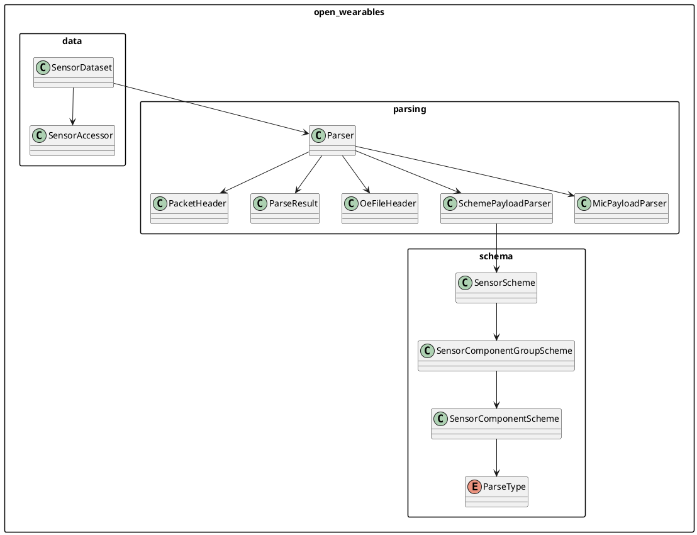
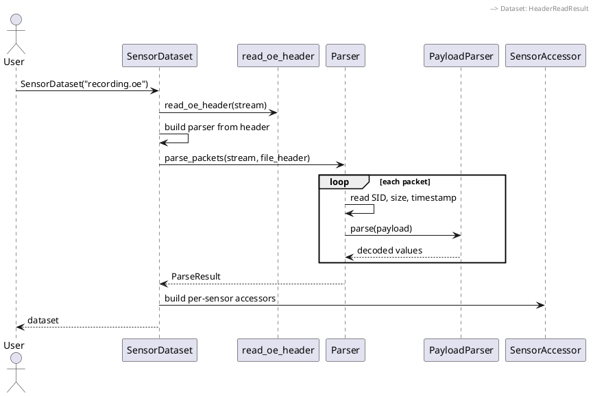
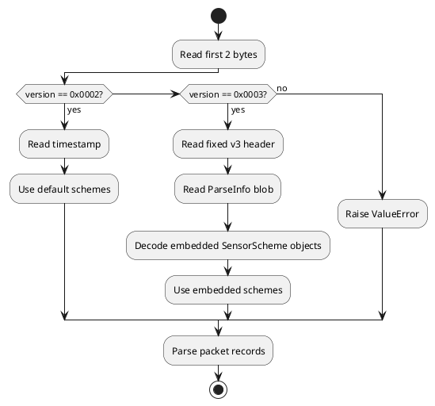
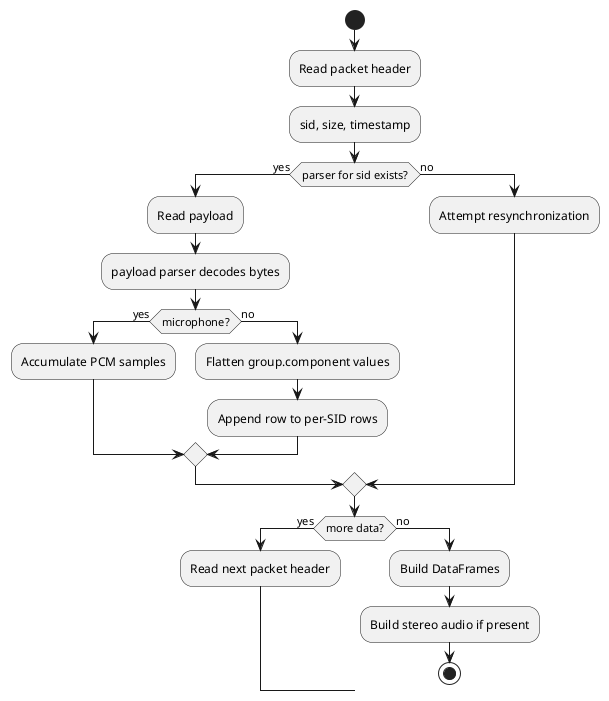

# Parser Internals

This document explains how `open-wearables` turns OpenEarable `.oe` files into
timestamp-indexed pandas DataFrames, and how the package is structured for
developers who want to maintain or extend the parser.

## Package Structure

The package is split into small layers:

| Module | Responsibility |
|--------|----------------|
| `open_wearables.data` | User-facing dataset API, sensor constants, and DataFrame accessors. |
| `open_wearables.parsing` | Binary file/header parsing, packet parsing, payload parsers, and audio conversion helpers. |
| `open_wearables.schema` | In-memory schema model used by payload parsers. |
| `open_wearables.ipc` | WebSocket IPC client models and transport logic. |
| `open_wearables.dataset` | Backward-compatible facade for older imports. |
| `open_wearables.parser` | Backward-compatible facade for older parser imports. |
| `open_wearables.scheme` | Backward-compatible facade for older schema imports. |

New parser code should generally live in `open_wearables.parsing`. New schema
types should live in `open_wearables.schema`. User-facing dataset behavior
belongs in `open_wearables.data`.



## High-Level Dataset Flow

`SensorDataset` owns the file-level flow. It checks the file header before it
builds a parser, so version `0x0003` files can provide their own embedded parse
schemes.

The flow is:

1. `SensorDataset(filename)` initializes empty state and placeholder accessors.
2. `SensorDataset.parse()` opens the file as binary.
3. `read_oe_header(stream)` probes and consumes the `.oe` file header if present.
4. `SensorDataset._build_parser(file_header)` chooses parser schemes:
   - v3 header with embedded schemes: use `file_header.sensor_schemes`.
   - v2 header: use `build_default_sensor_schemes(...)`.
5. `Parser.parse_packets(...)` parses packet records from the current stream position.
6. `SensorDataset._build_accessors()` wraps DataFrames in `SensorAccessor` objects.



## File Header Handling

Header parsing lives in `open_wearables.parsing.headers`.

`read_oe_header(stream)` returns a `HeaderReadResult`:

- `header`: an `OeFileHeader` when a supported file header is present.
- `initial_packet_bytes`: bytes that were already read before packet parsing starts.

`SensorDataset` expects supported `.oe` file headers. Unsupported header
versions raise `ValueError`.

### Header Version `0x0002`

Version `0x0002` contains only:

- `version: uint16`
- `timestamp: uint64`

The header has no embedded parse scheme. `SensorDataset` therefore uses the
default hard-coded sensor schemes for v2 files.

### Header Version `0x0003`

Version `0x0003` contains:

- `version: uint16`
- `timestamp: uint64`
- `header_size: uint32`
- `parse_info_size: uint32`
- `device_id: uint64`
- `side: uint8`
- `parse_info_blob: bytes`

The ParseInfo blob contains the active sensor list and each referenced sensor
scheme. `parse_parse_info_blob(...)` converts that blob into:

- `sensor_ids`
- `sensor_schemes`
- `sensor_config_options`

Those schemes become the source of truth for packet payload decoding.



## ParseInfo Decoding

The v3 ParseInfo blob starts with a sensor list:

| Field | Type |
|-------|------|
| Sensor Count | `uint8` |
| Sensor IDs | `uint8[]` |

It then stores each sensor scheme in the same order as the sensor IDs:

| Field | Type |
|-------|------|
| Sensor Scheme Size | `uint16` |
| Sensor Scheme | `byte[]` |

Each single sensor scheme contains:

- sensor ID
- sensor name
- component count
- one component record per component
- sensor configuration options

The parser converts the firmware enum values into `ParseType` values:

| Firmware Value | Python `ParseType` |
|----------------|--------------------|
| `0` | `INT8` |
| `1` | `UINT8` |
| `2` | `INT16` |
| `3` | `UINT16` |
| `4` | `INT32` |
| `5` | `UINT32` |
| `6` | `FLOAT` |
| `7` | `DOUBLE` |

Frequency metadata, when present, is stored in
`OeFileHeader.sensor_config_options[sid].frequency_options`.

Example:

```python
dataset = SensorDataset("recording.oe")
sid = dataset.SENSOR_SID["imu"]

options = dataset.file_header.sensor_config_options[sid]
sampling_rates = options.frequency_options.frequencies
default_rate = sampling_rates[options.frequency_options.default_frequency_index]
```

For v2 files, this metadata is not available in the file.

## Packet Parsing

Packet parsing lives in `open_wearables.parsing.stream.Parser`.

There are two entry points:

- `Parser.parse(stream)`: convenience method for streams positioned at the start of an OE file.
- `Parser.parse_packets(stream, ...)`: packet-only method for streams already positioned at packet data.

`SensorDataset` uses `parse_packets(...)` because it has already read the file
header before building the parser.

Each packet starts with a 10-byte packet header:

| Field | Type |
|-------|------|
| Sensor ID | `uint8` |
| Payload Size | `uint8` |
| Timestamp | `uint64` |

After reading a packet header, `Parser`:

1. Decodes the packet prefix into an internal `PacketHeader`.
2. Looks up a payload parser by sensor ID.
3. Reads `Payload Size` bytes.
4. Parses the payload.
5. Sends microphone payloads to the microphone accumulator.
6. Flattens grouped sensor values into DataFrame columns.
7. Adds rows into a per-SID row buffer.
8. Converts row buffers into pandas DataFrames at the end.

The parser keeps these internal steps in separate helpers so packet framing,
resynchronization, microphone accumulation, value flattening, and DataFrame
creation can evolve independently without changing the public API.



## Payload Parsers

Payload parser implementations live in `open_wearables.parsing.payload_parsers`.

### `SchemePayloadParser`

`SchemePayloadParser` decodes structured sensor payloads from `SensorScheme`
objects. It uses a single parse-type registry to derive both struct formats and
component byte widths, then precomputes the expected payload size from the
scheme component types.

It supports:

- fixed-size single samples
- buffered payloads with a trailing `uint16` time delta

Parsed values are returned as nested dictionaries:

```python
{
    "acc": {"x": 0.1, "y": 0.2, "z": 0.3},
    "gyro": {"x": 1.0, "y": 2.0, "z": 3.0},
}
```

`Parser` flattens these into DataFrame columns:

```text
acc.x
acc.y
acc.z
gyro.x
gyro.y
gyro.z
```

### `MicPayloadParser`

`MicPayloadParser` decodes microphone payloads as little-endian `int16` PCM
samples. Microphone samples are not directly added as normal sensor DataFrame
rows. Instead, the parser stores microphone packets and builds stereo audio
helpers from them.

## Accessors and DataFrames

`SensorDataset._build_accessors()` creates one `SensorAccessor` per known sensor
name. Each accessor exposes:

- `.df` or `.to_dataframe()` for the full sensor DataFrame.
- grouped sub-DataFrames for columns named `group.component`.
- direct access for single-level columns.

For v3 files, labels come from embedded sensor schemes when available. For v2
files, labels come from the default constants in `open_wearables.data.constants`.

## Compatibility Facades

The project keeps older import paths working:

- `open_wearables.parser` re-exports parser types from `open_wearables.parsing`.
- `open_wearables.dataset` re-exports dataset types from `open_wearables.data`.
- `open_wearables.scheme` re-exports schema types from `open_wearables.schema`.

New code should prefer the layered modules directly, but compatibility facades
should remain stable unless the project intentionally makes a breaking release.

## Extension Points

When adding a new sensor type or payload format:

1. Add or update schema definitions in `open_wearables.schema`.
2. Add a payload parser in `open_wearables.parsing.payload_parsers` if the
   generic `SchemePayloadParser` is not enough.
3. Register the parser in `SensorDataset._build_parser(...)` if it needs special
   behavior.
4. Add constants/accessor labels in `open_wearables.data.constants` only for
   v2/default-scheme compatibility.
5. Add tests with synthetic binary streams in `tests/`.

For v3-compatible sensors, prefer relying on the embedded ParseInfo scheme
instead of adding hard-coded labels.
